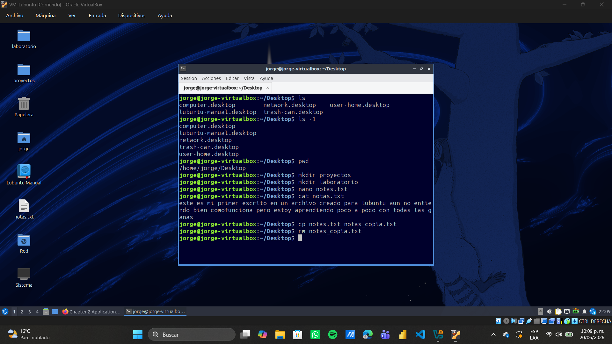

# Laboratorio-Linux
# Semana 1 - Día 3: Comandos básicos en Linux

## Comandos practicados
- **pwd** → muestra la ruta actual.
- **ls -l** → lista archivos con detalles.
- **mkdir laboratorio** → crea carpeta llamada "laboratorio".
- **nano notas.txt** → abre editor de texto para crear archivo.
- **cat notas.txt** → muestra contenido del archivo.

## Aprendizaje
Hoy aprendí a moverme en el sistema de archivos, crear y borrar carpetas, editar archivos de texto y actualizar paquetes con `apt`.
