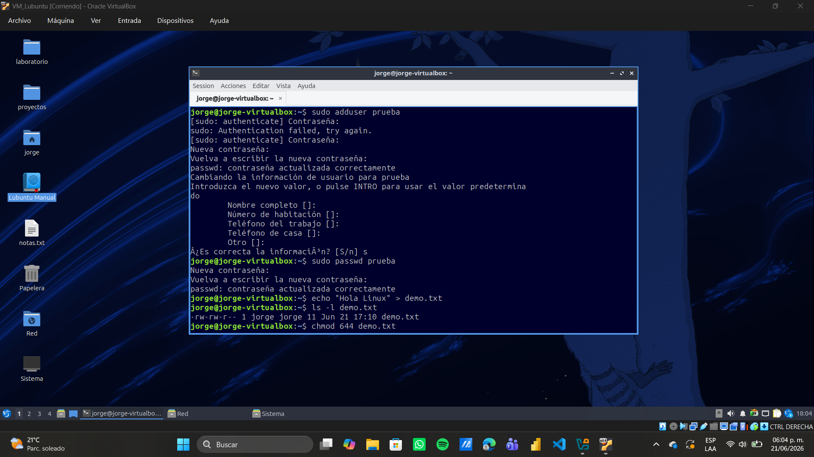

# 📚 Práctica Linux - Semana 1

En este 4to dia aprendi los **7 pasos básicos en Linux** que realice durante la práctica.

---

## Paso 1: Crear archivo
echo "Hola Linux" > demo.txt
ls -l demo.txt

---

## Paso 2: Ver contenido
cat demo.txt

---

## Paso 3: Listar archivo
ls -l demo.txt

---

## Paso 4: Cambiar permisos
chmod 644 demo.txt
ls -l demo.txt

---

## Paso 5: Cambiar propietario
sudo chown prueba demo.txt
ls -l demo.txt

---

## Paso 6: Ver procesos
ps aux | head -10
top

---

## Paso 7: Finalizar procesos
pkill nano

---

